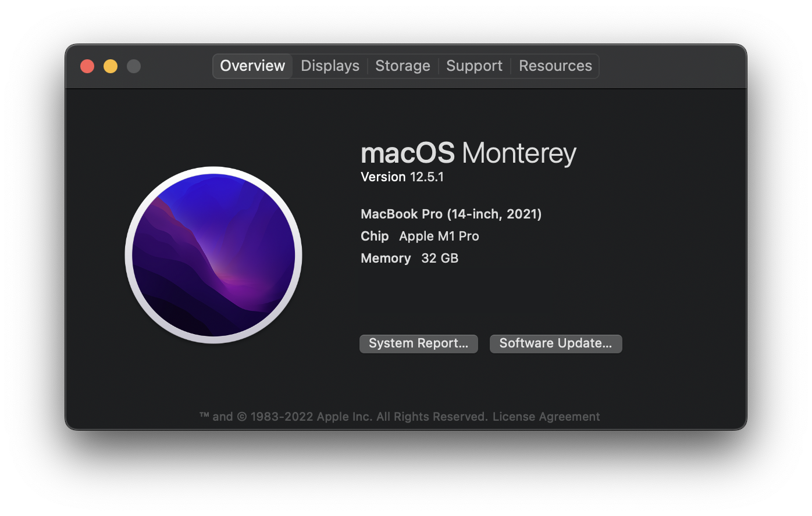
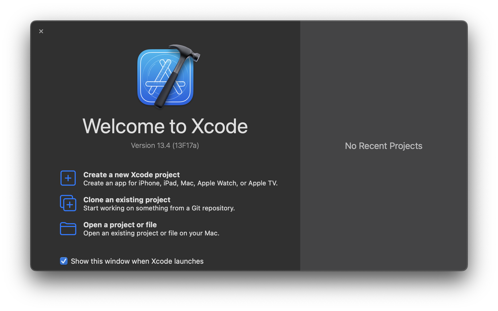

# Intro to iOS Development

Hi there! Welcome to our introductory iOS app development workshop. We’re so excited to have you :)

## Learning Objectives

This workshop series will expose participants to…

1. Fundamental [Swift](https://developer.apple.com/swift/) syntax and concepts
2. How to think critically about user interfaces
3. How to build user interfaces for iOS with [SwiftUI](https://developer.apple.com/xcode/swiftui/)
4. How to accept and respond to user interaction

## Your workshop lead

This workshop is led by [Sam Shi](https://samuelshi.com) who has been building iOS apps since 2019. He has worked on apps with hundreds of millions of users (most recently at Pinterest), teaches iOS development as Chief Learning Officer at [App Team Carolina](https://appteamcarolina.com), and has built ([and launched](https://apps.apple.com/ph/developer/samuel-shi/id1531813683)) a number of personal projects.

## Technology Setup

In order to participate in this workshop, we’ll need to make sure you have all of the required software.

### macOS Update

To make sure we can install and run the latest versions of all of the necessary tools, we will make sure we are all running the latest version of macOS. On your Mac, click on the  icon in your menu bar and click on “About this Mac”.

A window like this will open. If it says you’re running macOS 12.5.1, you’re all set! You can skip to the Xcode installation. Otherwise, click on “Software Update” and update to the latest macOS version.

		
What should I do if my device cannot run macOS 12?

    <a href="https://support.apple.com/en-us/HT212551">Here</a> is a list of devices that can run macOS 12. If you’re device is not supported, reach out to Sam (<a href="mailto:samshi@live.unc.edu">samshi@live.unc.edu</a>), and we will do our best to figure something out.

### Xcode Installation

iOS developers use Xcode to build, run, and deploy their apps. It's an IDE full of useful development tools such as a fantastic code editor, great debugging tools, and Simulators that allow you to run iOS apps directly on your Mac!!

1. Click [here](https://apps.apple.com/us/app/xcode/id497799835?mt=12) to download (or update) Xcode from the Mac App Store.
   - Warning: This might take a long time depending on your network speed.
2. After installation has completed, open Xcode from your Applications folder and complete all of the onboarding stages.
3. When you see this window, you've successfully installed Xcode!!

### SF Symbols

One of the absolute best things about developing for Apple platforms is the built-in library of free, high quality, customizable icons called SF Symbols.

We will be downloading a small app conveniently called SF Symbols to browse these icons. Click [here](https://devimages-cdn.apple.com/design/resources/download/SF-Symbols-3.3.dmg) to download the app.

### Troubleshooting

If you have any issues with this technology setup, please visit us in the XL (SN027) or [contact Sam](mailto:samshi@live.unc.edu) directly to get help.
